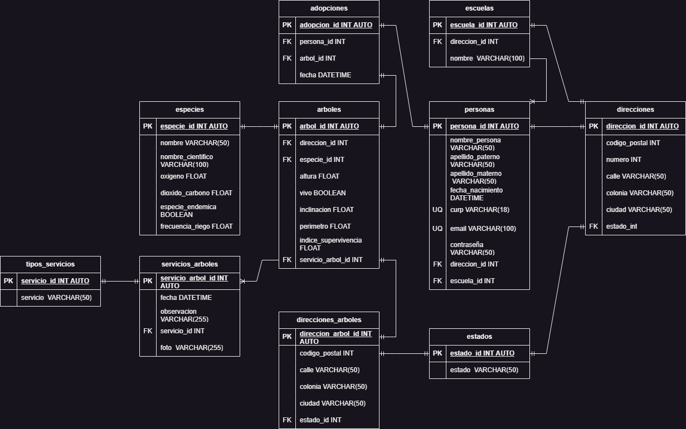

# DISEÑO Y MODELADO DE UNA BASE DE DATOS.

Base de datos que realicé para un proyecto en el cual formé parte.

Normalización:

- 1FN (Datos atómicos).
- 2FN (Todos los datos deben depender funcionalmente de la llave primaria).
- 3FN (Eliminación de dependencias transitivas).

### Diagrama entidad relación

-Andrés Mendoza.

